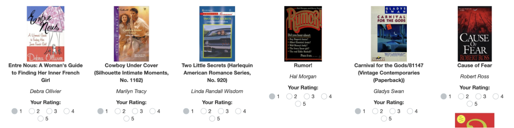
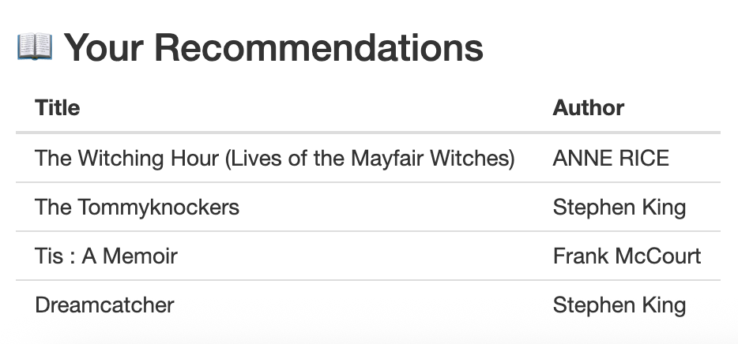

```{r setup, include=FALSE}
knitr::opts_chunk$set(echo = TRUE, message = FALSE, warning = FALSE)
library(data.table)
library(recommenderlab)
library(shiny)
library(shinyjs)
library(shinyWidgets)
```

# ***Introduction***

This report summarizes the progress on the ***Book Recommendation*** project. The system recommends books to users based on their ratings using collaborative filtering.

# ***Data Description***

The app uses two main datasets from the Book-Crossing dataset:

***BX-Books.csv***: contains book metadata (ISBN, title, author).

***BX-Book-Ratings.csv***: contains user ratings for the books.

Data cleaning steps include removing zero ratings, filtering users with fewer than 10 ratings, and filtering books with fewer than 20 ratings to improve recommendation quality.

# ***Methodology***

We preprocess the data, build a user-item rating matrix, normalize ratings to reduce user bias, and train a User-Based Collaborative Filtering (UBCF) model using the recommenderlab package.

### Load data
```{r load, eval=FALSE, echo=TRUE}
books_raw <- fread("BX-Books.csv", sep = ";", quote = "\"", encoding = "Latin-1")
ratings <- fread("BX-Book-Ratings.csv", sep = ";", quote = "\"", encoding = "Latin-1")
```

### Rename columns
```{r rename, eval=FALSE, echo=TRUE}
setnames(books_raw, c("ISBN", "Book-Title", "Book-Author"), c("item", "title", "author"))
setnames(ratings, c("User-ID", "ISBN", "Book-Rating"), c("user", "item", "rating"))
```

### Clean whitespace
```{r whitespace, eval=FALSE, echo=TRUE}
books_raw[, `:=`(item = trimws(item), title = trimws(title), author = trimws(author))]
ratings[, item := trimws(item)]
```

### Filter out low-quality data
```{r filter, eval=FALSE, echo=TRUE}
ratings <- ratings[rating > 0]
ratings <- ratings[user %in% ratings[, .N, by = user][N >= 10]$user]
ratings <- ratings[item %in% ratings[, .N, by = item][N >= 20]$item]
```

### Build rating matrix and limit size for performance
```{r ratingmax, eval=FALSE, echo=TRUE}
ratingmat <- as(ratings[, .(user, item, rating)], "realRatingMatrix")
ratingmat <- ratingmat[1:min(1000, nrow(ratingmat))]
```

### Train User-Based Collaborative Filtering model
```{r model, eval=FALSE, echo=TRUE}
model <- Recommender(normalize(ratingmat), method = "UBCF")
```

### Prepare books data for display (deduplicate and ordering)
```{r prepare, eval=FALSE, echo=TRUE}
books_raw[, `:=`(
  norm_title = tolower(gsub("[^a-z0-9]", "", title)),
  norm_author = tolower(gsub("[^a-z0-9]", "", author))
)]

book_counts <- ratings[, .N, by = item]
books_merged <- merge(books_raw, book_counts, by = "item", all.x = TRUE)
books_merged[is.na(N), N := 0]
setorder(books_merged, -N)

books <- books_merged[, .SD[1], by = .(norm_title, norm_author)]
books[, display := paste0(title, " by ", author)]
```

# ***Application Overview***

***A search bar to filter books by title or author.***
```{r image-plot1, echo = FALSE, out.width='50%', fig.align='center'}
knitr::include_graphics("search.png")
```

***Display of 12 books with cover images and star rating inputs.***
```{r image-plot2, echo = FALSE, out.width='70%', fig.align='center'}

```

***A button to generate recommendations once at least 5 books are rated.***
```{r image-plot3, echo = FALSE, out.width='25%', fig.align='center'}

```

***A display of the recommended books.***
```{r image-plot4, echo = FALSE, out.width='25%', fig.align='center'}

```

# ***Installation and Running the App***

To install the Book Recommender app from GitHub and launch it:

```{r install-full, eval=FALSE, echo=TRUE}
remotes::install_github("Programming-The-Next-Step-2025/book-recommender")
bookrecommender::run_app()
```
